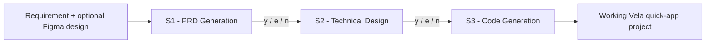

# Vela-JS-Skill

**An AI-driven, multi-stage development workflow for Xiaomi Vela quick apps (小米 Vela 快应用) — built as a plugin for [Claude Code](https://claude.com/product/claude-code).**

**Repository:** [github.com/Aser-Mohamed/Vela-JS-Skill](https://github.com/Aser-Mohamed/Vela-JS-Skill)

Vela-JS-Skill turns Claude Code into a guided workflow coordinator for VelaJS quick-app development: it takes a plain-language feature request (and, optionally, a Figma design) and walks it through requirements, technical design, and code generation — producing working `.ux` project files for Xiaomi Watch / IoT wearable targets.

---

## Table of contents

- [Why this exists](#why-this-exists)
- [How it works](#how-it-works)
- [Features](#features)
- [Requirements](#requirements)
- [Installation](#installation)
- [Quick start](#quick-start)
- [Workflow reference](#workflow-reference)
- [Bundled knowledge base](#bundled-knowledge-base)
- [Optional automation hooks](#optional-automation-hooks)
- [Project structure](#project-structure)
- [Maintainer guide: publishing and updating this repo](#maintainer-guide-publishing-and-updating-this-repo)
- [Contributing](#contributing)
- [License](#license)

---

## Why this exists

Building a Xiaomi Vela quick app means working inside a fairly narrow, well-defined platform: a specific component set, a specific `.ux` file format, Flexbox-only layout, and an API surface that doesn't tolerate guesswork borrowed from web or React Native conventions. Left to general-purpose reasoning, an LLM will happily invent APIs and layout patterns that don't exist on the platform.

Vela-JS-Skill solves this by pairing a **structured, checkpointed workflow** with a **bundled, platform-accurate knowledge base**, so Claude Code stops improvising and starts building against the actual constraints of the Vela runtime.

## How it works

Instead of a single "generate the app" prompt, the skill runs a three-stage pipeline with a human checkpoint after each stage:



At every checkpoint you respond with a single character:

| Input | Effect |
|---|---|
| `y` | Approve the current stage's output and move on |
| `e` | Give feedback and regenerate the current stage in place |
| `n` | Discard the output and start the stage over |
| `q` | Save progress and exit — resume later from the same point |
| `status` | Show progress across all three stages |
| `back` | Return to the previous stage |

A **quick mode** is also available, which skips straight to code generation for smaller, well-understood requests.

## Features

- **Three-stage guided pipeline** — PRD → Technical Design → Code Generation, each with its own checkpoint and its own output artifact.
- **Session persistence** — every run is tracked as a session under `.ai-workspace/sessions/`, so you can interrupt and resume a build at any point.
- **Bundled platform knowledge** — component/API whitelists, layout rules, `.ux` formatting rules, styling rules, naming and error-handling conventions, all loaded automatically as each stage needs them.
- **Design-driven generation** — optionally hand it a Figma link; it resolves the file and node, pulls the design data through Figma MCP, exports assets, and threads them through every stage. Falls back gracefully to description-driven generation when no Figma MCP is configured.
- **Optional safety hooks** — opt-in `PreToolUse` / `PostToolUse` / `UserPromptSubmit` hooks that guard against destructive shell commands, unauthorized package installs, and writes outside the project's expected directories.
- **Bilingual by design** — the workflow interface runs in Simplified Chinese (matching the primary Vela developer community), while remaining fully usable from an English-language Claude Code session.

## Requirements

| Requirement | Notes |
|---|---|
| [Claude Code](https://claude.com/product/claude-code) | This skill is distributed as a Claude Code plugin. It is not a standalone application. |
| An Anthropic account with access to Claude Code | Available through a [Claude Pro, Max, Team, or Enterprise plan](https://claude.com/pricing), or through the [Anthropic API](https://docs.claude.com) with billing enabled. All model access and usage is provided directly by Anthropic. |
| **Recommended model: Claude Opus 5.5** | This workflow performs multi-stage reasoning — requirements analysis, architectural decisions, and code generation against a constrained platform API. Opus 5.5 is Anthropic's most capable model and gives the most reliable results across all three stages. Sonnet-class models will work for simpler apps but may need more `e` (edit) iterations on complex requirements. |
| Xiaomi `aiot-toolkit` (for building/running the generated project) | Only needed once you're ready to compile and deploy the generated `.ux` project to a device or simulator — not required to use the skill itself. |
| *(Optional)* A Figma MCP connector | Needed only if you want to drive generation from a Figma design rather than a text description. |

## Installation

Vela-JS-Skill is distributed through its own Claude Code plugin marketplace, hosted directly in this repository. No separate download, build step, or manual file copying is required — everything below happens from inside Claude Code itself.

### Step 1 — Make sure the prerequisites are in place

- [Claude Code](https://claude.com/product/claude-code) is installed and you can start a session (`claude`).
- You're signed in to an Anthropic account with an active [Claude plan or API access](https://claude.com/pricing) (see [Requirements](#requirements) above).

### Step 2 — Add the marketplace

Inside a Claude Code session, run:

```
/plugin marketplace add Aser-Mohamed/Vela-JS-Skill
```

This points Claude Code at this repository's `.claude-plugin/marketplace.json`, which lists the plugin below. You only need to do this once per machine.

### Step 3 — Install the plugin

```
/plugin install vela-js-skill@vela-js-skill
```

Claude Code downloads the plugin and registers its skill immediately — **no restart required.**

### Step 4 — Verify it installed

```
/plugin
```

You should see `vela-js-skill` listed as installed and enabled. You can also run `/skills` and confirm `vela-js-skill` appears in the list.

### Step 5 — Try it

In any project directory:

```
/vela-js-skill
```

or just describe what you want in plain language (e.g. *"Create a Vela quick app that shows a step counter"*) — Claude Code will trigger the skill automatically. See [Quick start](#quick-start) below for what happens next.

### Troubleshooting

| Problem | Fix |
|---|---|
| `Marketplace "Aser-Mohamed/Vela-JS-Skill" not found` | Double-check the spelling, and that the repository is public. Re-run the `/plugin marketplace add` command. |
| Plugin installs but `/vela-js-skill` doesn't trigger | Run `/skills` to confirm it loaded; if the frontmatter looks fine but Claude still isn't using it, try invoking it explicitly with `/vela-js-skill` rather than relying on auto-detection. |
| Marketplace adds fine but install fails | Run `claude plugin validate .` against a local clone of the repo to check for a manifest issue, and confirm you have network access to GitHub. |

### Updating

Whenever this repository gets a new release, update your installed copy with:

```
/plugin update vela-js-skill@vela-js-skill
```

### Uninstalling

```
/plugin uninstall vela-js-skill@vela-js-skill
```

You can also remove the marketplace entirely with `/plugin marketplace remove Aser-Mohamed/Vela-JS-Skill` if you no longer want to track it.

## Quick start

Inside any project directory, in Claude Code, just describe what you want:

```
> Create a Vela quick app that shows a step counter with a daily goal ring
```

or invoke the skill explicitly:

```
/vela-js-skill
```

The workflow will:
1. Confirm your requirement back to you (`y` to proceed, `e` to revise)
2. Ask whether you have a design reference (Figma link/image, or skip)
3. Ask you to choose **Full workflow** (PRD → Design → Code) or **Quick mode** (code only)
4. Run each selected stage, pausing for your `y` / `e` / `n` at every step
5. Write the generated project files into your current working directory, and save the PRD and technical design docs under `.ai-workspace/sessions/<session-id>/`

For a full walkthrough with example output at every step, see [docs/USAGE.md](docs/USAGE.md).

## Workflow reference

| Stage | Name | Output | Precondition | Skippable |
|---|---|---|---|---|
| **S1** | PRD Generation | `01-prd.md` | None | Yes, in Quick mode |
| **S2** | Technical Design | `02-tech-design.md` | S1 complete (or none, in Quick mode) | Yes, in Quick mode |
| **S3** | Code Generation | Project source files | S2 complete (or none, in Quick mode) | Always runs |

Sessions are fully resumable: if Claude Code detects an in-progress session in `.ai-workspace/sessions/` when the skill starts, it offers to resume from the last completed stage rather than starting over.

## Bundled knowledge base

Each stage automatically loads only the knowledge it needs, keeping context usage efficient:

| Domain | File | Purpose |
|---|---|---|
| Development guide | `knowledge/vela-js-app.md` | Project structure, manifest, components, APIs, best practices |
| Platform constraints | `rules/vela-platform.md` | Component/API whitelist, disallowed dependencies |
| Code quality | `rules/vela-quality.md` | Naming, error handling, resource cleanup |
| Layout rules | `rules/vela-layout.md` | Flexbox layout conventions |
| File format rules | `rules/vela-format.md` | `.ux` file format requirements |
| CSS rules | `rules/vela-css.md` | Styling conventions |
| Project initialization | `rules/project-init.md` | Scaffolding requirements |
| Design-driven development | `rules/vela-design-driven.md` | Turning a design reference into implementation |
| Coding conventions | `rules/vela-coding-convention.md` | General coding standards |
| Figma MCP integration | `rules/vela-figma-mcp.md` | Design export and MCP configuration |
| Component / API quick reference | `prompts/*.prompt.md` | Loaded on demand during code generation |

See [docs/ARCHITECTURE.md](docs/ARCHITECTURE.md) for how these pieces fit together.

## Optional automation hooks

`reference/hooks/` includes three scripts that are **not enabled by default**, since they operate at the project level and would affect non-Vela projects if enabled globally:

| Script | Hook type | Purpose |
|---|---|---|
| `validate-write.sh` | `PostToolUse` | Restricts file writes to an allowed set of project directories |
| `guard-dangerous-cmd.sh` | `PreToolUse` | Blocks destructive shell commands and unauthorized package installs |
| `prompt-vela-workflow.sh` | `UserPromptSubmit` | Detects Vela-related requests and reminds the user to supply a requirement doc / design reference |

To enable them for a specific Vela project, copy the relevant script(s) into that project's `.claude/hooks/` directory and register them in the project's `.claude/settings.json`. See [docs/HOOKS.md](docs/HOOKS.md) for setup instructions.

## Project structure

```
Vela-JS-Skill/
├── .claude-plugin/
│   ├── plugin.json          # Plugin manifest
│   └── marketplace.json     # Marketplace manifest
├── docs/
│   ├── USAGE.md             # Full walkthrough with example output
│   ├── ARCHITECTURE.md      # How the coordinator, stages, and knowledge base fit together
│   └── HOOKS.md             # Optional safety hook setup
├── skills/
│   └── vela-js-skill/
│       ├── SKILL.md         # Workflow coordinator (entry point)
│       ├── stages/          # S1 / S2 / S3 stage definitions
│       ├── knowledge/        # Platform development guide
│       ├── rules/            # Platform constraints & conventions
│       ├── prompts/          # On-demand component/API reference
│       └── reference/
│           └── hooks/        # Optional project-level automation hooks
└── README.md
```

## Maintainer guide: publishing and updating this repo

This section is for whoever maintains this repository, not for end users installing the plugin.

**First-time publish:**

```bash
cd Vela-JS-Skill-repo
git init
git add .
git commit -m "Initial release"
git branch -M main
git remote add origin https://github.com/Aser-Mohamed/Vela-JS-Skill.git
git push -u origin main
```

**Shipping an update** (bump the version in `.claude-plugin/plugin.json` first, then):

```bash
git add .
git commit -m "Describe what changed"
git push
```

Anyone who already installed the plugin picks up the change the next time they run `/plugin update vela-js-skill@vela-js-skill`.

## Contributing

Issues and pull requests are welcome — particularly around expanding platform/API coverage in `knowledge/` and `rules/`, or refining the stage prompts in `stages/`. Please open an issue describing the change before submitting larger PRs.

## License

[MIT](LICENSE) © Aser Mohamed / Oreleon Technologies

---

*Vela-JS-Skill is an independent, community-built plugin. It is not affiliated with or endorsed by Xiaomi or Anthropic. "Claude" and "Claude Code" are trademarks of Anthropic, PBC.*
